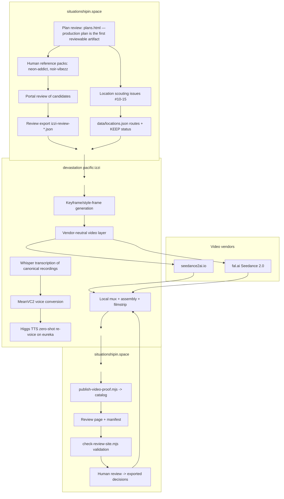
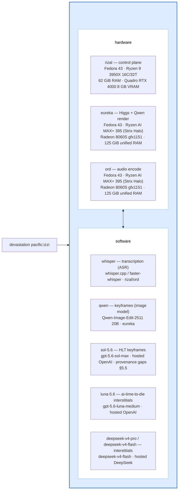
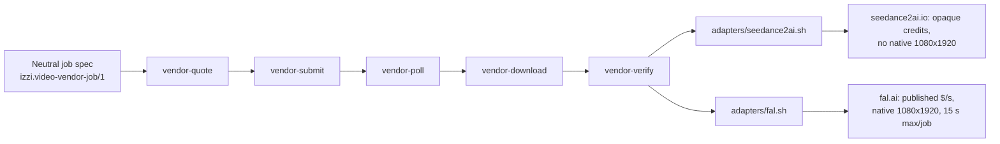
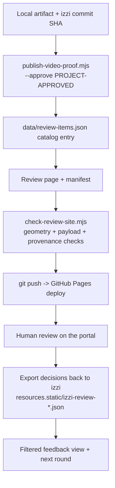
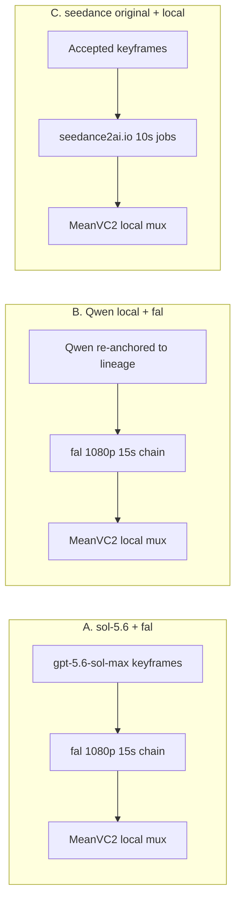

# explore_futures 2026-08-17 — fal.ai stage 2 status

Recorded: 2026-08-17 America/Los_Angeles
Status: `REVIEW-ROUND-OPEN; NO-SPEND; AUDIO-REJECT; VISUAL-SPLIT;
ANIMALS-ACCEPT-BACKGROUND-REVISE; AUDIO-RETURN-TO-LOCAL-CHANGED-VOICE`

This is the working status for the Runyon Canyon 30 s stage. It summarizes
what the 2026-08-17 unattended run delivered, what is outstanding, and what
is still open. The durable records are:

- `20260816.fal.ai.md` — plan, gates, and execution log
  (committed in `b55ae7de`).
- `build/private/fal2-runs/runyon-canyon-30s-20260817/run-results.md` — run
  results, acceptance, spend, live URLs.
- `build/private/fal2-runs/runyon-canyon-30s-20260817/keyframe-selection.md`
  — per-seed keyframe metrics and the provenance correction.
- Dyads `DYAD-2026-08-17-SNAPSHOT-{END-RUNYON-30S,BEGIN-RUNYON-REVIEW}-001`.

## 1. Current status

The 30 s Runyon render exists and is live for review:

- **Deliverable:** `runyon-30s-chain.mp4` — 30.21 s, 1080×1920, H.264,
  24 fps, vendor audio throughout, no local mux.
- **Live:** `https://situationshipin.space/review/provider-inputs/here-lies-trouble/runyon-canyon/run30/runyon-30s-chain.mp4`
  (J1, J2 rolls, probe, and keyframe seeds staged alongside).
- **Duration answer:** fal Seedance 2.0 returned 15.09 s natively at 720p
  fast and 1080p standard — the seedance2ai.io 10 s ceiling is gone, so the
  30 s form is two chained jobs, no hard total cap.
- **Geometry:** every provider original ffprobe-verified at exactly
  1080×1920, H.264, 24 fps, AAC audio stream.
- **Motion:** measured with the established band harness — J1 mid 62.3 /
  side 37.1; J2 roll 2 top 23.0 / mid 98.5 / side 63.0, versus the 9.7
  mid-band walking-in-place baseline.
- **Audio:** vendor audio only, per user decision. Whisper heard clean
  naturalistic dialogue on J1 and J2 roll 2. J2 roll 1 delivered silent
  ambience and was replaced by the authorized contingency re-roll.
- **Visual review 2026-08-17 (further):** the animals read as Neon Addict,
  but the rendered background does not — the environment lost the style
  grammar. The user notes the `gpt-5.6-sol-max` keyframe + seedance
  toolchain previously produced a coherent, delightful whole package; the
  Qwen keyframe path did not reproduce it here.
- **Spend:** $34.32 quoted against the $35.00 hard cap ($3.63 probe +
  three 1080p jobs). The fal dashboard is the independent confirmation.
- **Seedance2ai support response 2026-08-17:** the below-spec deliveries
  are acknowledged as a temporary, task-scoped variation; **2,000
  complimentary credits** granted, arrival within 24 hours (recorded in
  `20260815.vendor_audit_seedance2ai.md` §9). The credit
  grant is not yet verifiable from the session — no balance API exists —
  and the native-1080p claim is unverified.

Repos: izzi `main` at `b55ae7de` (clean, in sync with origin);
situationshipin.space `main` at `55ffd13` (clean).

## 2. Outstanding work

1. **User visual KEEP of the 30 s chain — SPLIT verdict recorded
   2026-08-17.** Animals: ACCEPT (Neon Addict reads through). Background:
   REVISE (not Neon Addict style). Task: restore the full style package —
   background grammar, palette, and texture — consistent with the
   `gpt-5.6-sol-max` + seedance reference the user preferred. The three
   Qwen keyframe seeds remain provisional; note the seed-1/seed-2
   provenance correction recorded in `keyframe-selection.md`.
2. **fal dashboard charge confirmation.** The quoted charges should match
   the dashboard; no usage API was reachable from the session. Also pending:
   the seedance2ai dashboard must show the +2,000 complimentary credits once
   the 24-hour arrival window passes.
3. **Re-render the chain audio with the old (local changed-voice)
   method.** Human review 2026-08-17: the 30 s chain **visual PASSES**, but
   the vendor audio is rejected — the dialogue is wholly fabricated and does
   not match the canonical source transcript. Task: produce the local
   MeanVC2 changed-voice track for the 30 s window (recording 2,
   660 000–690 000 ms, voice code V01) on eureka/ord using the established
   episode-01 pipeline, and mux it over
   `runyon-30s-chain.mp4` in place of the fal-generated dialogue. Zero
   provider spend; the existing `scripts/izzi-meanvc-runyon-canary.py`
   covers the 10 s form and needs the 30 s extension. The local track is
   the canonical dialog, not regenerated speech.
4. **Review the §5 workflow/model itemization.** Confirm where
   `gpt-5.6-sol-max` was actually used (transcript reading? Noir-vibezz
   keyframes?) and correct §5 where it disagrees with the real workflow
   history. The background-style regression makes this review more urgent:
   the generator lineage is implicated in whether the whole package holds.
   Diagram review 2026-08-17: §5.2.1 host/model map and §5.1 end-to-end
   process both **PASS**; what remains of this item is the
   `gpt-5.6-sol-max` provenance confirmation (transcript reading and
   Noir-vibezz keyframes).
5. **Qwen local-path decision.** Qwen-Image-Edit-2511 works on eureka but
   takes ~2 h 15 m per 720×1280 keyframe under sequential offload (the
   8060S's 62.5 GiB GTT carve-out cannot hold the 7B encoder plus ~40 GB
   transformer at once). A lighter host, a quantized path, or a hosted
   Qwen fallback is needed before any production cadence.

Not yet started, pending the KEEP: the remaining 135 s of the 165 s Runyon
episode chain (the current 30 s is the opening pass), and any full-episode
re-quote at fal rates.

## 3. Open questions

1. ~~Does the 30 s chain pass visual KEEP?~~ **Split verdict 2026-08-17:**
   animals pass, background fails. Open sub-questions: (a) is the background
   drift from the Qwen keyframe start frame, fal's motion rendering, or
   both; (b) does the fix belong in the keyframe (return to the sol-5.6
   lineage for the Runyon frame) or in the motion prompt?
2. Given the user's preference for the sol-5.6 + seedance whole package,
   should the keyframe path return to the OpenAI `gpt-5.6-sol-max` generator
   (needs `OPENAI_API_KEY`), or can a re-anchored Qwen pass restore the
   Neon Addict background grammar? Qwen local stays slow (~2 h 15 m/frame)
   but zero-spend and fully local.
3. ~~Is vendor audio the production pattern?~~ **Resolved 2026-08-17 by
   review:** fal's generated dialogue is invented, not the canonical words,
   so vendor audio fails the dialogue-fidelity bar. The local changed-voice
   mux is the audio path; vendor audio may remain as a non-dialogue
   ambience/SFX option only if the user ever wants it.
4. The full 165 s at fal 1080p quotes ≈ $112.53; does the user want a
   re-quote and funding decision now, or after the 30 s KEEP?
5. **Can `gpt-5.6-luna-medium` stand in for `gpt-5.6-sol-max` on the
   keyframe path?** Assessment 2026-08-17: not a drop-in per the records.
   The repository records luna-medium only in the ai-time-to-die T2
   interstitial storyline (sol-max → luna-medium → flash rebirth), never as
   a still-image generator; the accepted HLT keyframes' recorded lineage is
   the OpenAI image generator labeled sol-5.6. If luna-medium can drive the
   same OpenAI image-generation capability, a one-keyframe comparative
   canary against the accepted sample frames (then user KEEP) is the honest
   test; otherwise substituting severs the exact lineage Proposal A exists
   to restore. Either way it needs `OPENAI_API_KEY` and image-spend
   authorization.
6. **Which one-month OpenAI subscription shape.** Go $8/mo (Luna-only, no
   Sol), Plus $20/mo (cheapest plan that includes `gpt-5.6-sol`, so it
   keeps the keyframe lineage), Pro $100/$200 (not needed at this volume),
   or the API-only path (per-image + per-token, needs `OPENAI_API_KEY`).
   Time estimates for the vertical plan and the guilloche
   image-recognizer pass, one-month feasibility, and the
   pre-compute/orchestrate question are assessed at the end of §6.

## 4. Findings carried forward

- fal's native audio can trip its content policy on the first draw
  ("potential copyright violation"); the no-music/lyrics clause makes it
  pass and still yields dialogue.
- Even with the clause, one of two 1080p jobs came back silent; the plan's
  one-re-roll contingency covered it.
- **Review verdict 2026-08-17:** the vendor audio's dialogue is fabricated
  and does not match the canonical source transcript — the visual passes
  but the audio is rejected; the old local changed-voice method is
  re-applied to the chain.
- **Review verdict 2026-08-17 (further):** the rendered background is not
  Neon Addict style even though the animals are; the user found the
  `gpt-5.6-sol-max` keyframe + seedance combination produced a more
  delightful, coherent visual package. The measured Qwen keyframe palette
  drift (brighter/warmer means, larger lineage distance) is consistent
  with, but not proof of, the background regression.
- **Seedance2ai support response 2026-08-17:** 2,000 complimentary credits
  granted and the resolution anomaly called task-scoped and temporary; no
  rate card, refund answer, balance API, or 1080×1920 guarantee was
  supplied, so the audit's core geometry questions stay open until a
  verified 1080p test job or dashboard confirmation.
- Qwen-generated keyframes run brighter/warmer than the sol-5.6 lineage
  frames; per-seed metrics are recorded and the pick is provisional.
- GitHub Pages deploy failed transiently (429/503) during staging and was
  re-run; the seed-2 promotion reached the live URL after J1 submitted.

No credentials, no account state, and no further spend are implied by this
file. This stage is no-spend until the user acts on the items above.

## 5. Workflow breakdown — where each model is used

This section walks the process in the user's requested order: plan review,
style processing, and location scouting on situationshipin.space first, then
the per-episode generation pipeline, ending at proofing and reviewing
results. It itemizes which model or tool acts at each stage, and calls out
the two `gpt-5.6-sol-max` provenance questions explicitly (§5.5). Reviewing
this breakdown is outstanding item 4. The mermaid diagrams in this section
target the current Mermaid v11 release (render-verified with v11.16.1).

### 5.1 End-to-end process (plan review → style processing → location scouting → review)

**Human review verdict 2026-08-17: REVISE, then PASS.** The block-to-block
arrows of the first pass rendered as small arrows off to the side of the
boxes, so they were reverted. The diagram was reworked as a classical
three-box workflow — `situationshipin.space` → `devastation pacific:izzi`
→ `situationshipin.space` — with one centered arrow between each pair of
boxes, and the bottom `situationshipin.space` box carrying
`publish-video-proof.mjs`. **Second-pass verdict 2026-08-17: PASS** — the
three-box workflow is accepted.

### 5.2 Model and tool itemization

| Stage | What runs | Model / tool | Host | Recorded provenance |
|---|---|---|---|---|
| Style processing (portal) | human decisions on reference candidates | none (human review) | situationshipin.space | review exports `resources.static/izzi-review-*.json` |
| Location scouting (portal) | route KEEP decisions | none (human + map data) | situationshipin.space | `data/locations.json`, GitHub issues #10–15 |
| Transcript | speech-to-text of the canonical recordings | **Whisper** (`whisper.cpp` / faster-whisper, local) | rizal/ord | `*.txt` transcripts, `izzi-transcript-scene-cuts.py` |
| Voice change | speaker-obscuring conversion | **MeanVC2** (VC, not an LLM) | rizal CPU / ord | `scripts/izzi-meanvc-runyon-canary.py` |
| Re-voice | zero-shot dialogue regeneration | **Higgs Audio TTS v2** (audio model) | eureka, ROCm | `build-hlt-*-higgs-*.py` |
| Keyframes (HLT Neon Addict) | still image generation | **OpenAI image generator, `gpt-5.6-sol-max` label** (user-supplied provenance, 2026-08-16) | hosted | accepted `sample-01/02/03` style frames |
| Keyframes (noir/duotone) | photographic + animation style frames | **generator not named in the visual-method records** — see §5.5 | — | `duotone-111` style frames |
| Keyframes (current stage) | local still generation | **Qwen-Image-Edit-2511** (20B, Apache-2.0) | eureka | `build/private/qwen-image/` |
| Motion rendering | image/reference-to-video | **ByteDance Seedance 2.0** via either vendor | seedance2ai.io or fal.ai | run dirs under `build/private/` |
| Assembly/proofing | deterministic local work | none (izzi + ffmpeg + node scripts) | rizal | `publish-video-proof.mjs`, filmstrips |

### 5.2.1 Host and model map (visual form of §5.2)

The blue block expands the `devastation pacific:izzi` stage: the three local hosts with
their recorded os/hardware/ram (read-only inventory 2026-08-15, recorded in
`20260815.vendor_alternatives.md` §3.1), and the models used
across the workflow. `whisper` is ASR and `qwen` is an image model, not chat
LLMs; the hosted models (`sol-5.6`, `luna-5.6`, `deepseek-v4-pro`,
`deepseek-v4-flash`) come from
the ai-time-to-die proposal tree
(`proposal_vertical_v1.md`, seed-images/codex) and the T2 interstitial
track. `ord` runs Fedora 43 like rizal and eureka (corrected 2026-08-17).

**Human review verdict 2026-08-17: PASS.** The host/model map is accepted
as revised: the `devastation pacific:izzi` entry, the `hardware` and
`software` titles in black centered above their boxes, ord on Fedora 43,
the corrected model spellings (`luna-5.6`, `deepseek-v4-pro` /
`deepseek-v4-flash`), and the double-headed box arrow replacing the three
host-to-model arrows.

### 5.3 The two vendor option paths

The neutral layer (`build/private/video-vendor/`) is the switch point: the
pipeline speaks one job shape and each adapter maps it to its provider
contract. Today the production path is fal.ai; seedance2ai.io remains the
historical adapter.

### 5.4 Proofing and reviewing on situationshipin.space

Nothing reaches the portal without the explicit `--approve PROJECT-APPROVED`
gate, and every published artifact carries its izzi commit and hashes so the
review export can be traced back to the exact tree.

### 5.5 Open provenance questions (the sol-5.6 gaps)

The records support `gpt-5.6-sol-max` as the generator lineage for the
accepted HLT Neon Addict keyframes (user-supplied provenance recorded
2026-08-16). Two things the repository records do **not** support, and which
need the user's confirmation:

1. **Transcript reading.** The recorded transcript path is local Whisper,
   not an LLM. There is no record of `gpt-5.6-sol-max` reading transcripts;
   `audio.md` even records "the transcript was not read" for the energy
   pilot. Was sol-5.6 used in an earlier, unrecorded pass to interpret or
   paraphrase the transcript into visual prompts?
2. **Noir-vibezz keyframes.** The duotone/noir style-frame rounds describe
   "rebuilt" photographic frames and selected animation proofs without
   naming the still-image generator. Were those also `gpt-5.6-sol-max`
   outputs?

Resolving these two lines is the purpose of outstanding item 4; the
itemization above should be corrected to match the user's actual workflow
history where it disagrees with the records.

## 6. Outstanding issues — full-render proposals

The complete Here Lies Trouble vertical is 10 episodes × 165 s of generated
content (1,650 s), plus 10 × 3 s local title cards. Three full-render
proposals combine the toolchains already tried; each keeps the local
MeanVC2 changed-voice track for dialogue, since vendor audio is rejected
for fabricated speech.

### Proposal A — `gpt-5.6-sol-max` keyframes + fal.ai (preferred)

Generate all ten location keyframes with the OpenAI `gpt-5.6-sol-max`
generator (the lineage the user called delightful), hand each to fal
Seedance 2.0 at 1080p in 15 s last-frame chains, and mux the local
MeanVC2 changed-voice track. This is the one combination that reproduces
the whole visual package the user praised while keeping fal's native
1080×1920 delivery and its absent 10 s ceiling.

- Spend: ≈ **$1,125** video (1,650 s × $0.682) + OpenAI image generation
  (per-image, to quote).
- Jobs: 110 × 15 s (or 165 × 10 s if the last-frame chain prefers shorter
  seams).
- Time: ~2–3 weeks including 10 keyframe rounds and per-episode review.
- Risk: needs `OPENAI_API_KEY` for the keyframe generator; that path was
  not reachable from the 2026-08-16/17 sessions.

### Proposal B — local Qwen keyframes + fal.ai (zero-spend stills, slow)

Keep Qwen-Image-Edit-2511 on eureka but re-anchor each keyframe against the
accepted `gpt-5.6-sol-max` lineage frames so the background grammar, not
just the animals, carries into the render. fal renders 1080p 15 s chains;
audio stays local MeanVC2.

- Spend: ≈ **$1,125** video; keyframes $0 and fully local.
- Time: dominated by Qwen — ~2 h 15 m per 720×1280 still, so ~10–30
  keyframes is days of unattended compute before review rounds begin.
- Risk: the background fix is unproven; the split verdict may persist even
  after re-anchoring, and the iGPU cadence is slow for a 10-episode run.

### Proposal C — seedance2ai.io original toolchain (cheapest, known defects)

Return to the original vendor with the accepted keyframes, 10 s
image-to-video jobs, and local MeanVC2 mux. This is the historical
baseline and produced the package the user liked, but with the defects that
started the fal migration.

- Spend: opaque credits — 11 cr/s pro image-to-video → ≈ 18,150 credits for
  1,650 s, plus the list/reseller price question recorded in `cut-v1.md`.
  The 2026-08-17 **2,000 complimentary credits** offset this by roughly
  181 s of 720p-requested (11 cr/s) or ~83 s of 1080p-requested (24 cr/s)
  generation — a canary-scale grant, not a full-episode one.
- Time: similar to A, minus the fal adapter work.
- Risk: delivers 720×1280 when 1080p is requested (vendor now calls this
  "temporary" — unverified), has a 10 s/job ceiling (more seams), and
  offers no published per-second price or native 1080p.

### Decision factors

| Factor | A | B | C |
|---|---|---|---|
| Whole-package style (user's stated preference) | best | unproven after fix | good, historical |
| Native 1080×1920 | yes | yes | no (720×1280 observed) |
| Duration ceiling | none (15 s/job) | none (15 s/job) | 10 s/job |
| Dialogue fidelity | local MeanVC2 | local MeanVC2 | local MeanVC2 |
| Keyframe spend | OpenAI per-image | $0 | $0 |
| Calendar time | ~2–3 weeks | ~2–3 weeks + Qwen days | ~2–3 weeks |
| Open dependency | `OPENAI_API_KEY` | none | opaque pricing |

Recommendation to review: **A** restores the known-good style package with
the fixed geometry and duration answers; **B** is the fallback if keyframe
generation must stay local; **C** is only a cost comparison, not a
production recommendation.

### OpenAI subscription, calendar, and pre-computation assessment (2026-08-17)

This answers the follow-up questions against the 2026-08-17 plan state:
which ChatGPT subscription fits past use, whether one month suffices, how
long sol/luna would take for the vertical plan and the guilloche
image-recognizer pass, and whether jobs can be pre-computed and orchestrated
later. No subscription, API key, or image spend is authorized by this file;
every figure below is planning-only.

**One month — yes.** Go, Plus, and Pro all bill monthly and can be canceled
anytime; cancellation keeps access until the end of the current billing
period, and OpenAI supports no annual billing or multi-month prepay for any
of the three (official OpenAI Help Center: About ChatGPT Pro tiers; What is
ChatGPT Go?). A single month is therefore a valid shape: write the prompt
packs offline, buy the month, run, cancel.

**Cheapest plan for past use.** The repository's past OpenAI use is (a) the
accepted HLT keyframe lineage labeled `gpt-5.6-sol-max`, (b) plan/spec
drafting, and (c) the proposed guilloche vision-review loop; there is no
recorded API usage. Plan tiers per the official pages (2026-08-17):

| Plan | USD/mo | GPT-5.6 access | Image creation | Fit for this work |
|---|---|---|---|---|
| Go | $8 (US) | Luna only — no Sol | extended vs Free | vision review + drafting; cannot reproduce the sol lineage |
| Plus | $20 | Sol (Medium, High) + Luna | included, higher limits | cheapest plan with Sol; restores the keyframe lineage |
| Pro $100 | $100 | Sol + Extra High | 5× Plus allowance, faster | only if Plus limits are actually hit |
| Pro $200 | $200 | Sol + Sol Pro | 20× Plus allowance, unlimited/faster | not needed at this volume |

- **Cheapest:** Go $8/month (US launch pricing; the official Go page defers
  to the ChatGPT pricing page, so confirm the price there before purchase).
  Go can do the planning and the guilloche image-recognizer pass — Luna
  reads image input — but it does not include `gpt-5.6-sol`, so it cannot
  continue the sol-max keyframe lineage Proposal A exists to restore.
- **Cheapest that keeps the lineage:** Plus $20/month. The official
  model-per-plan table gives Plus `gpt-5.6-sol` at Medium/High reasoning;
  Free/Go get Luna only (official Help Center: GPT-5.6 in ChatGPT). This is
  the recommended default for a small keyframe + review month.
- **Pro is unnecessary** unless a limit is actually hit: $100 = 5× Plus
  allowance, $200 = 20× Plus. Ten location keyframes plus review passes is
  nowhere near that.

**API alternative (no subscription at all).** The images API is
pay-as-you-go: `gpt-image-1.5` is roughly $0.009–0.013 per low-quality
image, ≈ $0.034–0.051 medium, ≈ $0.133–0.200 high (official model page),
while `gpt-5.6-luna` and `gpt-5.6-sol` are per-token text rates (≈ $1/$6
and $5/$30 per 1M input/output tokens on the preview rate table). For the
projected volume — one comparative canary, ~10 final keyframes, and a few
batched vision passes — the API is single-digit dollars, cheaper than any
subscription, and is the only path with real job orchestration. It needs
`OPENAI_API_KEY` and image-spend authorization, which remain unset.

**Time: vertical planning with sol/luna.** "Computing what the vertical
needs" is the plan-vertical-scaffold product — 10-episode segment templates,
per-episode estimates, pilot options, and gates — derived from the existing
arc table in `full-vertical.md` and the fal rate evidence. That is a bounded
drafting task, not a long compute: `gpt-5.6-sol` (Plus Medium/High) should
produce a complete first draft in roughly a working day across one to three
sessions, followed by human review rounds; `gpt-5.6-luna` (Go Think) drafts
faster but with more rough edges to repair, so wall-clock is similar and
fidelity lower. The binding constraint is human review of the draft, not
model time.

**Time: guilloche with an image recognizer.** The guilloche review is
exactly the task a vision pass speeds up: round-05 per
`20260810.md` §X1 is ten digit + ten word + ten word-number
studies and ten wild portrait transitions — ≈ 40 proofs plus category grids
and decoded filmstrips — scored against five fixed questions (legibility,
floral integration, contour character, symmetry family, keeper triage); the
next fresh round adds 30 static proofs, ten wild-motion loops, and ten
title-card transitions. Interactively at roughly 2–5 min per proof, one
sol/luna pass over the ≈ 40-proof set is 1.5–3 hours, and two to three
passes fit in one to two days. Batched through the API — all 40 proofs plus
the rubric in one request (≈ 60k image input tokens) — the same pass takes
minutes and costs ≈ $0.30 at the sol input rate or ≈ $0.06 at the luna
rate. The recognizer changes the loop from days of human triage to minutes
of classification plus human confirmation.

**Pre-compute jobs, orchestrate later — yes, with one distinction.** Store
the job packs in the repository now (plan-draft prompts, the guilloche
rubric with image lists, keyframe prompt specs), and run them inside the
month. ChatGPT has no public pre-scheduling or batch queue, and automating
the ChatGPT interface is against its Terms (no programmatic extraction or
automation), so "orchestration" on a subscription means pasting stored
prompts, one pass at a time. The API is the real orchestrator: job specs can
be stored and replayed by scripts once `OPENAI_API_KEY` is set, with
per-call billing and no subscription clock. That makes the API the cleanest
pre-compute-now / complete-later route, at the cost of the authorizations
above.

## 7. Local voice-encoding improvements — vendor-clip comparison

The user's review compares the fal.ai clips with vendor voices (one of
which was observed saying the right words) against the original local voice
workflow, and asks what the local pipeline can learn from them. Ground
truth first, then suggestions.

### 7.1 Measured comparison

Canonical words, recording 2 @ 10:59 (the 30 s window's opening line):

> The only thing that kind of helped for us, it was good for us, was
> whenever they were up in the those little platforms, yeah, yeah, oh,
> yeah, yeah,

What Whisper heard on each track:

| Track | What it says | Words vs canonical | Level (mean / max) |
|---|---|---|---|
| local MeanVC2 V01 (10 s canary) | "The only thing that kind of helped for us… was whenever they were up in those little putt or… Yeah, oh yeah, yeah. Right, right." | **MATCHES** (word-accurate, slight drift at the end) | −20.2 dB / −4.5 dB |
| fal J1 (run30) | "Hey, look at that view. Not bad, huh? Bet we'll see the whole balan from the top" | invented | −27.3 dB / −5.0 dB |
| fal J2 roll 2 (run30) | "Man this trail never gets old, you know, just look at that view… worth every step" | invented | −35.1 dB / −11.4 dB |
| fal J2 (canary 2026-08-16) | "Those in the know held us in high regard. It was good for us too… Yeah. Oh, yeah, yeah." | **partially tracks** ("it was good for us", "oh, yeah, yeah") | — |

Reading: the local track wins on words (it is the canonical transcript),
the vendor tracks win on sonic character — natural prosody, expressive
multi-voice duet, ambient trail bed, and a produced mix. The user's "one
clip said the right words" observation corresponds to the canary J2, whose
phrasing partially tracked the canonical line while remaining partly
invented. Neither vendor clip is word-faithful end to end.

### 7.2 Suggestions for the local workflow

Keep the local path as the only word-faithful source; borrow the vendor's
production character.

1. **Higgs TTS re-voice from the canonical transcript, per speaker.** The
   current 10 s canary ran MeanVC2 as a single V01 voice over a 16 kHz mono
   source, which converts rather than re-performs. The existing recipe in
   `cut-v1.md` §E already does the better thing: align the transcript to
   engineering windows, generate each window on eureka with Higgs TTS 2
   using the per-window voice codes V01/V02/V03 (temperature 0.8 /
   top-p 0.9). That gives the vendor's multi-voice naturalness with the
   canonical words — the vendor clips are strong evidence this is the right
   direction.
2. **Add the ambience bed and ducking.** Vendor clips carry a location
   ambience bed under the dialogue; the local track is dry. Apply the
   recipe already specified: location ambience at −32 LUFS with 5 dB
   ducking, delivery −16 LUFS I / −1.5 dBTP / LRA ≤ 12.
3. **Match delivery dynamics to the vendor, not louder.** Local sat at
   −20.2 dB mean vs the vendor's −27.3 / −35.1 dB; the canary also showed a
   pre-normalization peak of 1.054 (clipped). Target the vendor's calmer
   mean with more headroom, and fix the pre-normalization overshoot.
4. **Full-bandwidth source.** The 10 s canary was 16 kHz mono (upscaled to
   48 kHz stereo only at delivery). Generate at native 48 kHz stereo from
   the start — MeanVC2 at native rate or Higgs directly — so the track does
   not begin behind the vendor on spectral quality.
5. **Mine a vendor clip as a prosody reference, not as dialogue.** If the
   user confirms the canary J2 clip as the desired character, keep it as a
   local Higgs zero-shot voice/prosody reference only; the words always come
   from the transcript. Governance is unchanged: the original recording
   never leaves local storage, and only the transformed/re-synthesized mix
   is staged.
6. **Word-fidelity acceptance gate.** The existing Whisper check proves
   intelligibility, not fidelity. Add a transcript-alignment check (Whisper
   text vs the canonical window text) to the local pipeline so "says the
   right words" is asserted, not eyeballed.

Net: the vendor clips do not replace the local voice path — they refine its
target. Words from the transcript, character from the vendor comparison,
delivered through the Higgs + ambience recipe that already exists locally.
