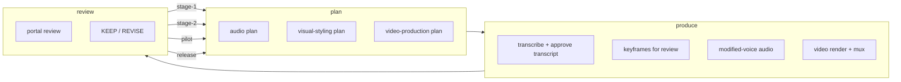

# Izzi workflow v2 proposal

Status: `PROPOSAL-2026-08-18; AUTHORIZED; IMPLEMENTING-W1-W7`
Recorded: 2026-08-18 America/Los_Angeles

Revision 1 (2026-08-18): human review verdict `REVISE` — section 7 now
assigns the mermaid diagrams for both v1 and v2 to sol-5.6 re-authoring.
Revision 2 (2026-08-18): human review verdict `REVISE` — section 4.1 now
accepts multiple candidate style grammars instead of neon-addict alone.
Revision 3 (2026-08-18): bug filed and resolved — section 5 now prescribes
the Responses API `apply_patch` tool with a V4A patch harness instead of
unified diffs inside a JSON schema field (issue #1).
Authorization: GRANTED 2026-08-18 (approve plan; snapshot dyad end;
resume work).

## 1. Directive

```text
snapshot dyad end. Then, write a new proposal that includes the below details, output in (20260818.workflow_v2_proposal.md) that proposes a new workflow, based on the workflow_v1 diagram located (the 5.1 three-box workflow). That workflow general concept would be plan -> produce -> review, with feedback loops between review->plan for stage-1, stage-2, pilot, release development stages. The plan stage would be broken into separate audio, visual-styling, and video-production stages. The visual-stylyin stage is the picking and tuning of neon-addict style plus the generation of keyframes for review, approving "visual-styling" before "visual-production" can start. Audio track is independent, and is composed of highest-quality voice-to-text transcription of the canonical source text (propose vendor and devastation-pacific options), then putting that text up on situationshipin.space for human review and approval, then using that approved text as the "canonical source edited" for the next step, which is the transformation of the text to modified voices (local or vendor) speaking the lines (allow human editors to put motions in the transcript track with text annotations of the form RESPONSE_BEGIN [action] RESPONSE_END where "action" is something like: snort, look at animal [name], pause, sniff a flower, watch a butterfly. Using the "canonical source edited" text, render highest quality audio for human review. After approval of that, then "video-production" stage is unlocked. Include this prompt in the file at the beginning of the proposal. Suggest a plan for using open-ai for generating via api key method, as per the previous guillloche, moire, surface-tension proposals. The outputs will be an analysis section of the proposal doc with 1-3 suggetions for possible improvement, documentation updates for izzi with new workflow as part of a toplevel izzi/docs/workflows.md file that is the toplevel for (visual_workflow.md, audio_workflow.md), update doc links, followed by the implementation gated steps, and devastation-pacific proofing and inspection of the generated diagrams on situationshipin.space
```

## 2. Baseline

Baseline v1 is the accepted §5.1 three-box workflow recorded in
[`20260817.fal.ai_stage_2.md`](20260817.fal.ai_stage_2.md):

- `situationshipin.space` → `devastation pacific:izzi` →
  `situationshipin.space`, with one centered arrow between each pair of
  boxes and the bottom `situationshipin.space` box carrying
  `publish-video-proof.mjs` (second-pass PASS 2026-08-17).

The v1 internal nodes remain authoritative vocabulary:

- `situationshipin.space`: plan review (`plans.html`), human reference
  packs (neon-addict, noir-vibezz), portal candidate review, review export,
  location scouting issues (#10-15) and `data/locations.json` routes.
- `devastation pacific:izzi`: Whisper transcription (A1), MeanVC2 voice
  conversion (A2), Higgs TTS re-voice on eureka (A3), keyframe/style-frame
  generation (K1), vendor-neutral video layer (V1), local mux + assembly +
  filmstrip (P1).
- `Video vendors`: seedance2ai.io (V2), fal.ai Seedance 2.0 (V3).
- bottom `situationshipin.space`: publish, review page + manifest,
  `check-review-site.mjs`, human review and exported decisions.

## 3. Workflow v2 concept

The v2 loop is `plan → produce → review` with a `review → plan` feedback
edge at each development stage: **stage-1, stage-2, pilot, release**.



The four feedback edges carry the stage name, so every `REVISE` decision
returns to the same stage's plan with its evidence attached.

## 4. Plan stage decomposition

### 4.1 Visual-styling

Pick and tune **one or more candidate style grammars** — not neon-addict
alone. Example candidates: the existing K1 neon-addict grammar, a
noir-thriller grammar drawn from the noir-vibezz reference pack, and the
duotone-111 grammar used for the here-lies-trouble vertical. Each candidate
grammar produces its own per-location keyframe set for review (K2 framing,
K5 publication), and the review compares the candidates side by side on
situationshipin.space. **Gate:** human approval of the chosen
visual-styling grammar (or an explicit KEEP-PARTS mix) unlocks
"video-production"; no video work starts before that approval.

### 4.2 Audio (independent track)

1. **Transcription.** Highest-quality voice-to-text transcription of the
   canonical source text.
   - Vendor option: OpenAI transcription API (`gpt-4o-transcribe`) for
     noisy naturalistic audio.
   - Devastation-pacific option: local faster-whisper/whisperx (the
     existing A1 whisper lineage) on devastation pacific, zero-spend and
     offline.
   - The transcript goes to situationshipin.space for human review; the
     approved text becomes **canonical source edited**.
2. **Modified voices.** Transform the approved text into the modified
   voices speaking the lines. Local: MeanVC2 conversion + Kokoro target
   voices (A2), or Higgs TTS re-voice on eureka (A3) for the
   high-compute pass. Vendor: clean-read TTS only as a fallback for
   scratch timing; the modified-voice character remains a local pass.
   Human editors may annotate the transcript track with motions:
   `RESPONSE_BEGIN [action] RESPONSE_END`, where `action` is drawn from a
   bounded vocabulary such as `snort`, `look at animal [name]`, `pause`,
   `sniff a flower`, `watch a butterfly`.
3. **Audio render for review.** Using canonical source edited, render the
   highest-quality audio and publish it for human review. **Gate:** audio
   approval, together with the visual-styling approval, unlocks
   "video-production".

### 4.3 Video-production

Unlocked only after both approvals. The vendor-neutral video layer (V1)
hands the accepted keyframes to fal.ai Seedance 2.0 (1080p 15 s chains)
with seedance2ai.io as the credit-backed contingency, then local mux with
the approved audio.

## 5. OpenAI API usage plan

Same method as the guilloche, moire, and surface-tension rounds:

- Model `gpt-5.6-sol` via the Responses API with `service_tier: "flex"`
  (Batch rates) and a standard-tier fallback on 429; reasoning effort high
  for design turns, medium for mechanical edits, never pro mode.
- Scope: sol-5.6 authors **code and documentation changes only** — the
  workflow docs, the mermaid diagrams, the `RESPONSE_BEGIN`/`RESPONSE_END`
  annotation schema and validator, the stage-register schema, and the
  portal review-page helpers. Transcription, audio rendering, keyframe
  generation, and video are tooling steps performed locally or by vendors,
  not by the API round.
- Editing contract: sol-5.6 edits the working tree through the Responses
  API `apply_patch` tool (`tools=[{"type":"apply_patch"}]`) — the model
  returns `apply_patch_call` items (`operation.path`, `operation.diff` in
  V4A format), a local harness applies each operation and replies with
  `apply_patch_call_output` (`call_id`, `status`, optional `output`), and
  the round continues with `previous_response_id`. Unified diffs inside a
  JSON schema field are retired: they produced `git apply --check`
  failures across the guilloche, moire, surface-tension, and keyframes
  rounds, tracked as
  issue #1.
- Packaging: workflow sources and the stage register are plain text; the
  neon-addict reference set is sampled and resized (about 30 plates at
  1024 px, ~29K image tokens) only when style tuning is in scope.
- Cost against the $50 balance, per prior measurements: a one-shot survey
  ~$0.36; a 30-turn Flex round ~$8.60; Batch/Flex for mechanical bulk
  ~$5-6; worst case ~$19.50. Standard-tier fallback for Flex 429s roughly
  doubles per-request fees, so prefer Flex and retry before falling back.
  Transcription and TTS are separate tooling costs and are not part of
  this estimate.

Official references: [GPT-5.6 Sol model page](https://developers.openai.com/api/docs/models/gpt-5.6-sol),
[pricing](https://developers.openai.com/api/docs/pricing),
[Flex processing](https://developers.openai.com/api/docs/guides/flex-processing),
[Apply Patch](https://developers.openai.com/api/docs/guides/tools-apply-patch).

## 6. Analysis — possible improvements

1. **Machine-checkable gates.** Publish the two approvals as portal
   artifacts (`visual-styling.json` and `audio.json` with KEEP/REVISE),
   and teach `check-review-site.mjs` (or a new checker) that
   video-production entries must not appear before both gates are KEEP.
   Today the unlock rule lives only in prose.
2. **Explicit stage register.** Add a `workflow-stages.json` enumerating
   stage-1, stage-2, pilot, and release, each carrying its plan artifact,
   produce artifacts, review decision, and the review→plan edge. That
   makes all four feedback loops traceable instead of implicit.
3. **Annotation schema and alignment.** Define the `RESPONSE_BEGIN
   [action] RESPONSE_END` grammar in a schema, validate bracket pairing
   and action names, and align each annotation span with the transcript's
   VAD windows so the motion track stays machine-processable into MeanVC2
   timing.

## 7. Documentation updates

- Add `izzi/docs/workflows.md` as the top level for
  `docs/visual_workflow.md` and `docs/audio_workflow.md`. It carries the
  workflow v2 diagram, the stage gates, and pointers to both existing
  pointer indexes.
- Have sol-5.6 re-write the mermaid diagrams for **both** Baseline v1 (the
  accepted §5.1 three-box workflow) and workflow v2 (the plan → produce →
  review loop with the four review→plan feedback edges), authored fresh
  against the current Mermaid release. Both diagrams land in
  `docs/workflows.md` and are render-verified locally before portal
  inspection.
- Update doc links: the top-level README/doc index links to
  `docs/workflows.md`; `docs/visual_workflow.md` and
  `docs/audio_workflow.md` gain a "parent workflow" line back up to
  `docs/workflows.md`; refresh the document-map entries.
- Existing pointer indexes stay un-rewritten (house rule: sort and link,
  do not rewrite evidence).

## 8. Gated implementation steps

| Step | Gate | Deliverable |
|---|---|---|
| W1 | Draft approved | `docs/workflows.md` + workflow v2 mermaid (local render-verify) |
| W2 | Visual-styling review | Portal visual-styling approval artifact + checker rule |
| W3 | Transcript review | Canonical source edited transcript page on situationshipin.space |
| W4 | Annotation review | `RESPONSE_BEGIN`/`RESPONSE_END` schema + validator + MeanVC2 timing notes |
| W5 | Audio review | Portal audio approval artifact + checker rule |
| W6 | Stage register review | `workflow-stages.json` with the four review→plan edges |
| W7 | Diagram review | Devastation-pacific proofing, portal publication, human inspection |

Each step is a separate review cycle: plan → produce → review with the
stage-name feedback edge; a step only advances on its gate.

## 9. Devastation-pacific proofing and portal inspection

Every generated diagram is render-verified locally on devastation pacific
against the current Mermaid release (the same v11.16.1 procedure used for
§5.1), then published to situationshipin.space as a review page (the
existing publish-* script pattern), run through
`check-review-site.mjs`, and inspected by a human before acceptance. The
pre-existing 17 here-lies-trouble provider-input findings remain a
separate portal cleanup item and are not introduced by this workflow.

## 10. Authority and next step

- This proposal performs no provider calls, no code changes, and no portal
  publication.
- On authorization: run W1-W7 in order with per-step commits, publish each
  gate artifact for human review, and keep all video spend behind the
  visual-styling and audio approvals.

## 11. Stage log

| Step | Gate | Result | Izzi commit | Portal commit |
|---|---|---|---|---|
| W1 | Draft approved | `docs/workflows.md` authored by `gpt-5.6-sol` via the Responses `apply_patch` tool; Baseline v1 and Workflow v2 mermaid diagrams render-verified under Mermaid v11.16.1; README and parent-workflow links updated; `scripts/openai-apply-patch-round.py` harness added. API cost ~$0.06 (Flex). | `45fe5220` | — |
| W2 | Visual-styling review | Portal `data/gates/visual-styling.json` published with decision `PENDING` (awaiting human KEEP/REVISE); `check-review-site.mjs` now blocks video-production entries until visual-styling and audio both carry `KEEP`. Checker holds at the 17 pre-existing here-lies-trouble findings. | — (portal-only; recorded in this commit) | `8273acc` |
| W3 | Transcript review | Canonical source transcript published for audio-plan review at `review/here-lies-trouble-canonical-source-transcript/` (verbatim two-part container, decision UNREVIEWED); `scripts/publish-transcript-review.mjs` added; `.txt` allowed in the review media contract. | — (portal-only; recorded in this commit) | `d632840` |
| W4 | Annotation review | `docs/audio_workflow/annotation_schema.json` (`izzi-response-annotation/1`), `docs/audio_workflow/annotation_schema.md` (grammar, VAD alignment, MeanVC2 timing), and `scripts/check-response-annotations.py` validator added; self-test and VAD-alignment fixtures pass. | this commit | — |
| W5 | Audio review | Portal `data/gates/audio.json` published with decision `PENDING` and evidence links to the transcript review page and annotation schema; checker now reports both gates and still blocks video-production entries. | — (portal-only; recorded in this commit) | `41b8ad0` |
| W6 | Stage register review | `workflow-stages.json` (`izzi-workflow-stages/1`) added with stage-1, stage-2, pilot, release, each carrying plan/produce/review sections and an explicit review→plan edge; `scripts/check-workflow-stages.py` validates the register. | this commit | — |
| W7 | Diagram review | Both diagrams published as chrome-rendered PNGs to the portal family `workflow-v2-diagrams` with review pages and an index; `check-review-site.mjs` passes except for the 17 pre-existing here-lies-trouble findings. Human inspection: <https://situationshipin.space/review/workflow-v2-diagram-index/>. | this commit | `f38dd4b` |
