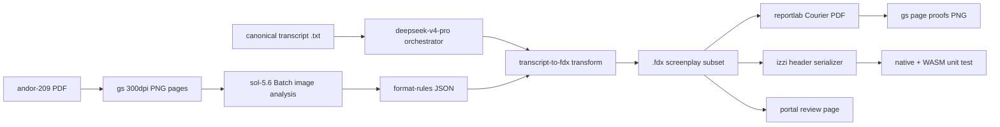

# Transcription enrichment — stage 1 plan (E1 + E2)

Status: `PROPOSAL-2026-08-20; AUTHORIZED; IMPLEMENTED-G1-G7; AWAITING-HUMAN-REVIEW`
Recorded: 2026-08-20 America/Los_Angeles

Authorization: PENDING — no provider spend, repository mutation, or portal
publishing happens until the human approves this plan. The working snapshot
dyad for this round is
`DYAD-2026-08-20-SNAPSHOT-BEGIN-AWAITING-NEXT-DIRECTION-002` (izzi
`e3f76efb`, portal `1516566`).

Revision 1 (2026-08-20): human resolved all four open questions — spend cap
`$25` approved with the Batch endpoint at its cheapest rate tier; `SPEAKER
1`–`6` cues with no invented names; FDX-first with Fountain fallback;
proceed to enrich the still-`UNREVIEWED` canonical transcript.

Revision 2 (2026-08-20): plan approved — implementation run authorized
unattended with `$25` spend, izzi and portal commit/push authority, and a
completion notification at G8.

Revision 3 (2026-08-20): E2 data-form field names renamed per human
direction — `needs` becomes `green` (wants) and `no` becomes `red`
(rejects); schema version bumped to `izzi-production-needs-2`.

Revision 4 (2026-08-20): section 3.1 revised — E1 outputs both the `.fdx`
(interpolated) and `.fountain` (open screenplay markup) styles, and the
human reviewers pick which is better.

Revision 5 (2026-08-20): G1-G7 complete. Batch findings: gpt-5.6-sol
rejects `flex` and the legacy `standard` tier name; the run submitted on
`default` (cheapest available), 55/55 succeeded, and 23/55 records with
unescaped quotes in text samples were salvaged via the bounded geometric
pattern in `scripts/izzi-aggregate-format-rules.py`. Measured geometry
(scene 1.47", character 3.68", dialogue 2.46", parenthetical 2.87") drives
the render; both candidate styles are published for review.

## 1. Directive

Resume direction recorded in
[`20260820.transcribe_enrichment.md`](20260820.transcribe_enrichment.md),
verbatim:

```text
Add a formatting layer as a post-transcription option.

Read: /home/bkoz/src/izzi/resources.rizal/final-draft
  . ├── andor-209.POST-FINAL.20240303.pdf
    └── network_needs_202605.pdf

And write a proposal to do E1 and E2 below.

E1: enrich format change — take the canonical here-lies-trouble transcript,
transform it to the "final draft (version 13)" format (more expansive), using
andor-209.POST-FINAL.20240303.pdf as the formatting example. Render that PDF
as PNGs for sol-5.6 image-to-text analysis, read www.finaldraft.com, and
synthesize a documented workflow (mermaid), python scripts, and
src/izzi-svg-text-transcription-enrichment.h. Use the OpenAI Batch method
with existing keys, as before; check the bug report about garbled returned
patches first. deepseek-v4-pro orchestrates the returned info into the izzi
repository. Propose documentation, usage examples, example files, workflow
diagrams, and testing.

E2: assess platform content fit — break network_needs_202605.pdf into a
usable data form (production houses, needs, no) at
resources.static/production-fit/2026-05-production-needs.json, then analyze
the E1 content for platform fit and note matched categories. Try a
v1-deepseek text pass first; suggest an optional v2-sora image pass.

Testing: generate E1 outputs from the here-lies-trouble transcript and put
the review document on situationshipin.space; generate the E2 fit document
from the enhanced transcript and save it on situationshipin.space for human
review.

Write analysis, proposal, and staged implementation plan to
20260820.transcribe_enrichment_stage_1.md.
```

## 2. Evidence inventory

- **Transcript input (E1).** Portal artifact
  `here-lies-trouble-canonical-source-transcript` at
  `review/media/audio-transcript/here-lies-trouble-canonical-source-transcript.20260818.txt`
  — two concatenated otter.ai seed transcripts, 9,450 words, 291 speaker
  turns, 23.5 minutes, speakers `1`–`6` plus `Unknown Speaker` (111 turns),
  zero bracketed stage-direction cues. Portal state is
  `UNREVIEWED / NOT-PROMOTED`; this plan consumes it as input per the
  directive and does not change that record.
- **Format reference (E1).** `resources.rizal/final-draft/andor-209.POST-FINAL.20240303.pdf`
  — 55 pages, US Letter, PDF 1.3, Creator `Final Draft 13`. Observed layout:
  `INT./EXT. SCENE HEADING` slugs with left/right scene numbers, uppercase
  action, centered character cues, indented dialogue, `(parentheticals)`,
  `(CONT'D)`/`(MORE)`, header `209 POST FINAL -- 3.3.24`, page number with
  trailing period, and a title page (`PILGRIM 2`, `Episode #209`, writer,
  `POST FINAL`, date).
- **Needs document (E2).** `resources.rizal/final-draft/network_needs_202605.pdf`
  — 13 pages, PDF 1.7, Author Warner Bros., dated 5/8/26. `pdftotext -layout`
  yields clean, machine-usable text (636 lines): streaming houses (Amazon,
  Apple, Disney+, FX, HBO, HBO Max, Hulu, MGM+, Netflix, Onyx, Paramount+,
  Peacock, Starz) and broadcast (ABC, CBS, FOX, NBC), each with contacts,
  brand identity, needs buckets, and "not looking for" / "no fly zone"
  exclusions.
- **Bug report on garbled patches.** izzi issue #1
  (`sol-5.6 Responses JSON-schema diff output yields invalid unified diffs;
  adopt apply_patch tool`) — closed. Conclusion to carry into this plan:
  diff-in-JSON output from sol-5.6 is unreliable (`corrupt patch`, `patch
  fragment without header`), but Batch/Flex and standard-tier Responses calls
  are fine for data extraction and generation. File edits are applied by the
  orchestrator with `apply_patch`; the model never emits diffs as a schema
  field. The existing V4A harness is
  `scripts/openai-apply-patch-round.py` (interactive Responses only; the
  Batch endpoint cannot loop tool calls, so it is not used for edits here).
- **OpenAI credentials/method.** Key file at
  `/home/bkoz/.config/izzi/private/openai_devpac_api_v1.key` (never printed
  or committed); gpt-5.6-sol text rates are pinned in
  `scripts/openai-apply-patch-round.py`. Batch submissions for image + text
  analysis use structured JSON output, matching the "Batch method as before"
  pattern described in issue #1.
- **Render tooling already in-repo.** `gs` 300 dpi PNG rasterization and
  accent extraction in `scripts/render-audit-usage-blackout-draft{1,2,3}.py`;
  `pdftotext`/`pdfinfo` present; Python `reportlab` 4.5.1 available for
  deterministic screenplay PDF emission; headless Chrome already used for
  mermaid rasterization. Portal publishing templates:
  `scripts/publish-transcript-review.mjs` + `scripts/review-page.mjs`.
- **Izzi header convention.** `src/izzi-svg-text-overlay.h` is the model for
  `src/izzi-svg-text-transcription-enrichment.h`: pure, dependency-free
  string serialization, deterministic native-C++ and WASM output, GPL
  header, provenance recorded per artifact. Tests live under `tests/`
  (`*.cc`), wired through `tests/CMakeLists.txt`.

## 3. Analysis

### 3.1 E1 — what "Final Draft 13 format" means here

Final Draft 13 saves scripts as `.fdx` (XML; root
`<FinalDraft DocumentType="Script" ...>`, `Content`/`Paragraph` elements),
with the six script element types: Scene Heading, Action, Character,
Dialogue, Parenthetical, Transition. The andor-209 PDF is the visual ground
truth for the rendered page: Courier 12, letter page, the indents and casing
listed in section 2, continuation `(CONT'D)`/`(MORE)`, and a title page.

Because the exact FDX schema is proprietary, G2 asks sol-5.6 to read the
rendered pages and extract a **minimal FDX-compatible subset** plus the page
geometry; the serializer only emits that subset. E1 emits **both styles
side-by-side for review**:

- `.fdx` — the interpolated Final Draft XML subset, rendered to the Courier
  PDF and page proofs;
- `.fountain` — open screenplay markup carrying the same elements.

The human review pass picks the preferred style; both remain reproducible
from the same transcript by the same transform, and neither contains
invented content.

### 3.2 E1 — transformation contract (no invented content)

The project rule "must not invent dialogue" applies verbatim. Enrichment adds
**format, not words**:

- Utterance text is copied from the transcript unchanged; only mechanical
  cleanups sol lists explicitly are allowed (whitespace, capitalization of
  character cues), and each is recorded.
- Speaker labels become screenplay character cues as `SPEAKER 1` …
  `SPEAKER 6` and `UNKNOWN SPEAKER` — no invented names; a cast/title page
  maps cues to transcript speakers and the human can rename them in review.
- Scene headings derive only from stated context in the transcript (the
  consent line names the venue); if context is insufficient the plan uses a
  single minimal `INT. TABLE READ` style slug and flags it.
- Action/parentheticals are emitted only from explicit transcript cues.
  Since the transcript has no bracketed cues, the initial screenplay is
  dialogue-only with the slug and cue blocks; nothing is staged in.
- Timestamps are preserved in a sidecar provenance JSON
  (`turn -> [speaker, start, end]`) rather than injected into the screenplay
  body.

### 3.3 E1 — roles and pipeline



`sol-5.6` owns format *reading* (image-to-text rules extraction); the
orchestrator owns the deterministic transform, the C++ header, docs,
scripts, and repo edits — exactly the division of labor the directive names.

### 3.4 E2 — data form and fit

The v1-deepseek pass is viable without any image reading: `pdftotext`
extraction of `network_needs_202605.pdf` was verified clean during this
planning pass. The proposed form:

```json
{
  "schema_version": "izzi-production-needs-1",
  "generated_at": "...",
  "source": "network_needs_202605.pdf",
  "source_sha256": "...",
  "as_of": "2026-05-08",
  "houses": [
    {
      "house_id": "netflix",
      "name": "Netflix",
      "platform": "streaming",
      "contacts": [{ "name": "Jinny Howe", "title": "Head of UCAN Scripted Series" }],
      "brand_identity": "...",
      "needs": [{ "bucket": "Voice Driven", "detail": "BEEF, MAID" }],
      "no": [{ "item": "Anthologies" }],
      "note": "..."
    }
  ]
}
```

The fit pass maps the E1 enhanced screenplay's observable attributes
(dialogue-driven meta-theater subject, underrepresented-voice story about
Filipino performers reclaiming their narrative, cabaret/Mark Taper context)
against each house's `needs` and `no` lists, and emits a fit document with
per-house fit/miss verdicts, matched categories, and quotes from the source.
An optional v2-sora image pass re-reads the original PDF pages only if the
text pass leaves a section ambiguous (none observed so far).

### 3.5 Batch-vs-tool conclusion (from the bug report)

- Batch is used for one-shot structured extraction/generation only.
- The Batch endpoint is used at its **cheapest available rate tier** (flex
  where sol supports it for the request shape; otherwise the standard-tier
  Batch 50% rate), and the per-batch request mix is dry-run estimated before
  submission.
- No diffs are requested inside any JSON schema field.
- Repo edits are applied locally by the orchestrator via `apply_patch`; the
  `apply_patch` tool harness is reserved for interactive rounds and is not
  part of the Batch path.

## 4. Proposed deliverables

- `docs/development/transcription-enrichment/README.md` + workflow diagram
  (`*.md` with mermaid) and usage examples.
- `scripts/izzi-openai-batch-client.py` (upload, poll, download, verify) and
  `scripts/transcribe-to-final-draft.py` (transcript → FDX subset → reportlab
  PDF → gs page proofs).
- `src/izzi-svg-text-transcription-enrichment.h` — FDX/screenplay element
  model + serializer, text-overlay-style, deterministic native/WASM.
- `tests/transcription-enrichment.cc` + `tests/CMakeLists.txt` wiring.
- E1 outputs: `.fdx`, rendered PDF, PNG page proofs, provenance sidecar.
- E2 outputs: `resources.static/production-fit/2026-05-production-needs.json`
  and the fit document/JSON.
- Portal review pages for both E1 and E2 (new families, same publish +
  `review-page.mjs` pattern as the transcript review).

## 5. Staged implementation plan

- **G0 — approval gate.** Human has resolved the four open questions and
  approved the `$25` spend cap; the final "go" for implementation is still
  pending. Nothing mutates repositories, submits batches, or publishes
  before the go-ahead.
- **G1 — prep.** Hash-pin both PDFs and the transcript; snapshot the
  bug-report conclusion into the workflow doc; scaffold
  `scripts/izzi-openai-batch-client.py` with a dry-run request validator (no
  API calls yet).
- **G2 — format extraction (spend).** Rasterize the 55 andor pages with the
  audit-usage `gs` 300 dpi settings; submit one Batch of sol-5.6 image
  requests at the cheapest available rate tier asking for element
  definitions, indents/casing, page furniture, and FDX subset fields; verify
  JSON parses against a local schema; record cost against the cap.
- **G3 — workflow docs.** Write the mermaid workflow, FDX subset contract,
  transformation rules (section 3.2), and usage examples.
- **G4 — Python transforms.** Implement
  `scripts/transcribe-to-final-draft.py`: parse speaker/timestamp turns,
  emit the FDX subset, render the Courier PDF via reportlab, and produce gs
  PNG proofs; golden-test on a small fixture plus the full HLT transcript.
- **G5 — izzi header.** Implement
  `src/izzi-svg-text-transcription-enrichment.h` as a dependency-free
  serializer for the same element model; add
  `tests/transcription-enrichment.cc` (round-trip, element ordering, no
  invented content invariants, normalized string equality native-vs-WASM
  where the existing test pattern applies) and run `make check` /
  the in-repo equivalent.
- **G6 — E1 review artifact.** Generate the HLT `.fdx` + PDF + proofs;
  publish a portal review page (new family
  `here-lies-trouble-final-draft`) and refresh the build manifest + checker.
- **G7 — E2 review artifact.** Emit `2026-05-production-needs.json` via the
  v1-deepseek pass; run the fit analysis on the G6 screenplay; publish the
  fit document as a portal review page (family `production-fit-2026-05`);
  note the optional v2-sora pass.
- **G8 — human review.** Both portal pages await KEEP / REVISE; iterate on
  REVISE before any promotion.

## 6. Verification plan

- FDX output: well-formed XML, only allowed element types, utterance text
  hash-equal to the transcript after the recorded mechanical cleanups
  (dialogue no-invention check).
- PDF/proofs: page count and page geometry match the G2 rules; gs rasterizes
  every page; OCR-free visual check of one page.
- Header: native unit test passes; serializer output byte-stable across
  repeated runs.
- Portal: `node scripts/update-build-manifest.mjs` +
  `node scripts/check-review-site.mjs` pass with only the 17 pre-existing
  exclusions; headless-Chrome review-page smoke check.
- E2 JSON validates against `izzi-production-needs-1`; every house carries
  non-empty `needs`/`no` arrays and a source citation.

## 7. Cost and authority notes

- **Spend cap approved 2026-08-20: `$25` hard stop**, using the Batch
  endpoint at its cheapest available rate tier for every submission. The G2
  page batch and the E2 text pass are dry-run estimated at G1 and recorded
  in the dyad before any API call.
- No diffs from the model; no secrets in artifacts; batch outputs are
  redacted receipts (ids, counts, cost) following existing house practice.

## 8. Decisions (resolved 2026-08-20)

1. **Spend cap:** `$25` hard stop, Batch endpoint at its cheapest available
   rate tier.
2. **Speaker cues:** `SPEAKER 1`–`6` and `UNKNOWN SPEAKER`, no invented
   names.
3. **Format target (revised 2026-08-20):** output both styles — `.fdx`
   (interpolated) and `.fountain` (open screenplay markup) — and let the
   human reviewers pick which is better.
4. **Transcript state:** proceed with enrichment now even though the
   canonical transcript remains `UNREVIEWED` on the portal.

## 9. Actual OpenAI spend (appended 2026-08-20)

Final Batch `batch_6a87ab985774819095a3241096444a2e` (default tier — the
cheapest tier gpt-5.6-sol accepts; flex and the legacy `standard` name were
both rejected) completed 55/55 with 0 failures.

Billed usage summed from the downloaded output file:

- input tokens: 179,740 (includes the 55 page images)
- output tokens: 99,099
- cached tokens: 0

Cost at the pinned gpt-5.6-sol default-tier rates (input `$2.50`/1M, output
`$15.00`/1M) with the Batch 50% discount:

- input: `179,740 / 1,000,000 * 2.50 * 0.5` = `$0.225`
- output: `99,099 / 1,000,000 * 15.00 * 0.5` = `$0.743`
- **Total: `$0.97`**

The two earlier rejected submissions processed zero requests and incurred
`$0`. Total OpenAI spend for the run is therefore **`$0.97`**, against the
approved `$25` cap. (The API exposes billed token counts but not a
per-request dollar figure; the dollars above are computed from the rates
pinned in `scripts/izzi-openai-batch-client.py`, and image input tokens are
folded into the input-token total.)
