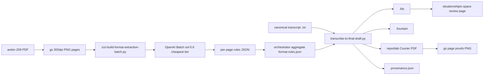
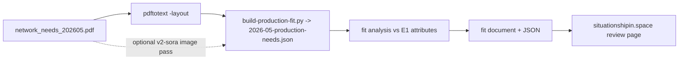

# Workflow and FDX subset contract

## E1 pipeline



## E2 pipeline



## FDX subset contract

The serializer emits only this subset of the Final Draft 13 document:

```xml
<?xml version="1.0" encoding="UTF-8"?>
<FinalDraft DocumentType="Script" Template="No" Version="1">
  <Title>…</Title>
  <Content>
    <Paragraph Type="Scene Heading"><Text>…</Text></Paragraph>
    <Paragraph Type="Action"><Text>…</Text></Paragraph>
    <Paragraph Type="Character"><Text>…</Text></Paragraph>
    <Paragraph Type="Dialogue"><Text>…</Text></Paragraph>
    <Paragraph Type="Parenthetical"><Text>…</Text></Paragraph>
    <Paragraph Type="Transition"><Text>…</Text></Paragraph>
  </Content>
</FinalDraft>
```

Element vocabulary and rendering geometry come from the G2 per-page rules
aggregated into `format-rules.json`; the Python transform and the C++ header
share the same element model so both emit equivalent documents.

## Final Draft 13 page geometry (measured, G2)

Median indents across the 55 andor-209 page records read by sol-5.6:

| Element | Left indent (inches) | Casing |
| --- | --- | --- |
| Scene heading | 1.47 | UPPER |
| Action | 1.47 | Mixed |
| Character | 3.68 | UPPER |
| Parenthetical | 2.87 | Mixed |
| Dialogue | 2.46 (right margin 2.5) | Mixed |
| Transition | 1.47 | UPPER |

Courier 12, letter page, 1" top/bottom margins, header top-left
`SHOW -- DRAFT N`, page number top-right with trailing period.

## Orchestration rules

- Batch is one-shot structured extraction only; cheapest available tier
  (standard for gpt-5.6-sol — flex is rejected for this model).
- No diffs in JSON output; orchestrator applies edits with `apply_patch`.
- Dry-run estimate must stay under the approved cap before every submit.
