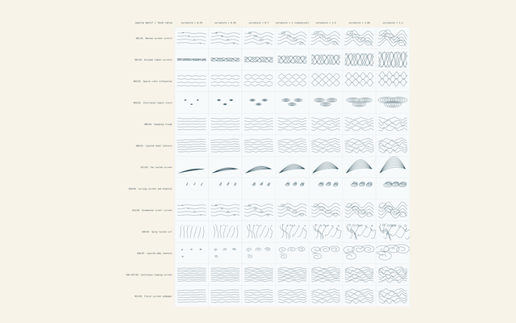
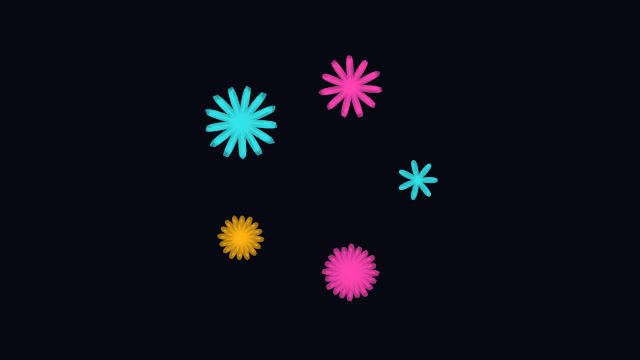
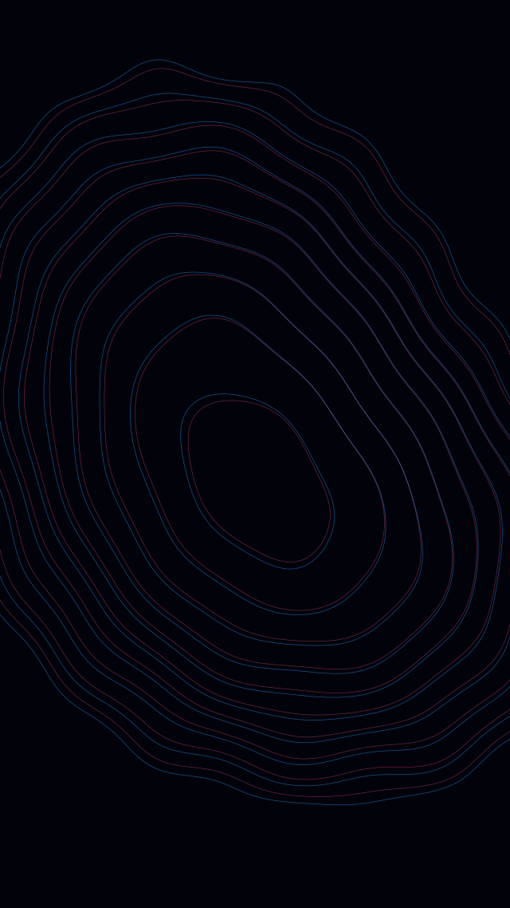
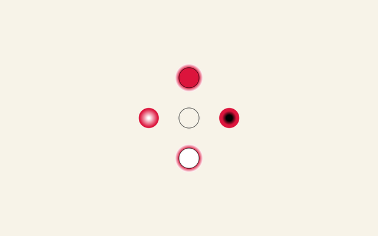
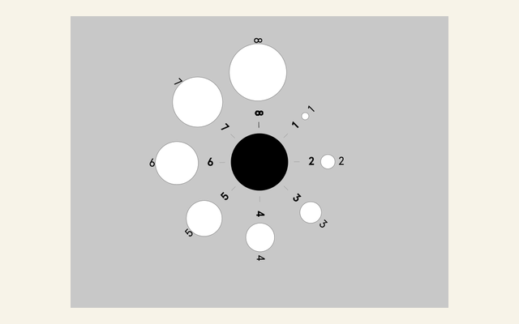
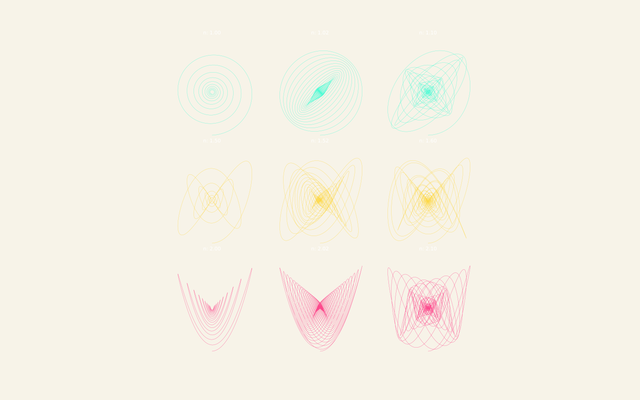
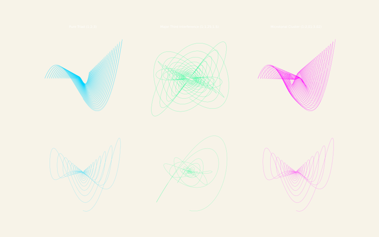
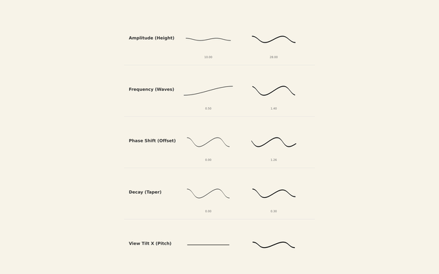
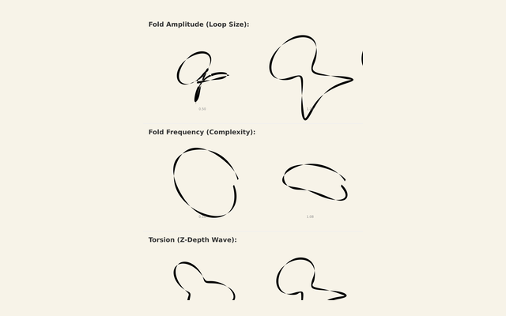
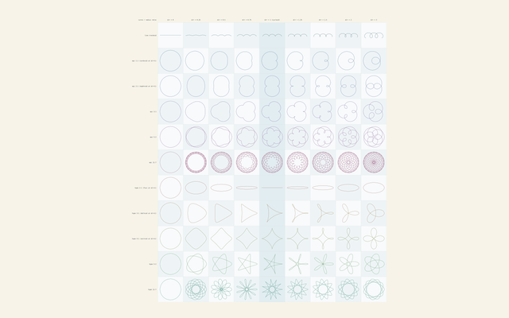

# Generative pattern families

First-pass index for the generative curve and pattern families implemented in
`izzi/src/`. This is a pointer index only; the family entries hold the
content.

## Document map

| File | Content |
| --- | --- |
| `docs/generative_patterns/index.md` | Directory entry page mirroring this index |
| `docs/generative_patterns/assessment_plan.md` | Assessment plan and per-family entry template |
| `docs/generative_patterns/hamonshu.md` | Family entry: hamonshu, including the Hamonshū volume 2 wave-pattern catalogue and rendering notes |
| `docs/generative_patterns/guilloche.md` | Family entry: guilloche |
| `docs/generative_patterns/moire.md` | Family entry: moire |
| `docs/generative_patterns/danmu.md` | Family entry: danmu (danmaku text overlay), incl. W3C Bullet Chatting relation |
| `docs/generative_patterns/surface_tension.md` | Family entry: surface tension |
| `docs/generative_patterns/radial.md` | Family entry: radial |
| `docs/generative_patterns/harmonograph.md` | Family entry: damped harmonograph |
| `docs/generative_patterns/grignani.md` | Family entry: grignani |
| `docs/generative_patterns/roulette.md` | Family entry: roulette |
| `docs/generative_patterns/images/` | Rendered previews from the parameter-space visual testers (gallery below) |
| `docs/visual_workflow/visual_experiments_method.md` | Form-first method for visual experiments (cross-cutting, not family-specific) |

## Family index (izzi/src)

| Family | Headers | Docs / notes |
| --- | --- | --- |
| hamonshu | `src/izzi-svg-curves-hamonshu.h`, `src/izzi-svg-curves-hamonshu-v2.inc` | `docs/generative_patterns/hamonshu.md` (incl. wave-pattern catalogue and rendering notes); Doxygen under `docs/html/` |
| guilloche | `src/izzi-svg-guilloche.h`, `src/izzi-svg-guilloche-json.h`, `src/izzi-svg-graph-guilloche.h` | `docs/visual_workflow/tool_guilloche.md` |
| moire | `src/izzi-svg-moire.h` | visual experiments method |
| danmu | `src/izzi-svg-text-overlay.h` | `docs/generative_patterns/danmu.md`; W3C Bullet Chatting relation; `examples/text-danmu-[1-5].cc` |
| surface tension | `src/izzi-svg-surface-tension.h` | visual experiments method |
| radial | `src/izzi-svg-radial*.h` (6 headers) | visual experiments method |
| damped harmonograph | `src/izzi-svg-curves-damped-harmonograph.h` | — |
| grignani | `src/izzi-svg-curves-grignani.h` | — |
| roulette | `src/izzi-svg-curves-roulette.h` | — |

Doxygen-generated API reference for the family headers lives in `docs/html/`.

## Visual-tester gallery

Each family's parameter-space explorer example renders a grid or plate set that
sweeps its configuration surface. The previews below are those renders; the
generation classes each example exercises are listed beside the image.

| Family | Parameter-space example | Generation classes | Preview |
| --- | --- | --- | --- |
| hamonshu | `examples/curves-hamonshu.cc` (13 curated motifs × 7 curvature ratios) | `svg::hamonshu::motif_config`, `pattern_spec`, `pattern_box` |  |
| guilloche | `examples/guilloche-plates.cc` (composition kinds × render profiles) | `izzi::guilloche::composition_spec`, `plate_spec`, `scene_spec`, `render_profile` |  |
| moire | `examples/moire-plates.cc` (10 named plate scenes) | `izzi::moire::scene_spec`, `render_profile` |  |
| surface tension | `examples/surface-tension-plates.cc` (10 named plate scenes) | `izzi::surface_tension::scene_spec`, `contour_layer_spec`, `render_profile` |  |
| radial | `examples/radial-gradient-variants.cc`, `examples/radial-graph-kusama-1.cc` (gradient and orbit parameter variants) | `svg::graph::radial_orbit_spec`, `svg::graph::radial_dataset`, `svg::radial` |   |
| damped harmonograph | `examples/curves-harmonic-4.cc` (interval × drift grid; `curves-harmonic-3.cc` triple explorer) | `generate_damped_harmonograph()`, `generate_triple_harmonograph()` |   |
| grignani | `examples/curves-grignani-2.cc` (ripple amplitude/frequency/phase/decay/tilt grid; `curves-grignani-1.cc` ribbon grid) | `svg::grignani::ribbon_config`, `ripple_config` |   |
| roulette | `examples/curves-roulette.cc` (radius/kind parameter space) | `svg::roulette::trochoid_config`, `roulette_config`, `roulette_kind` |  |

The guilloche, moire, and surface-tension previews are the canonical named
plates from their plate examples (`variant-data-orbit-experimental.svg`,
`moire-01-linear-close-beat.svg`, `surface-tension-01-paired-drops.svg`).

Status: `FIRST-PASS-SORT; HAMONSHU-CATALOGUE-MERGED-INTO-FAMILY-ENTRY; VISUAL-TESTER-GALLERY-ADDED; NOT-SHARED`
