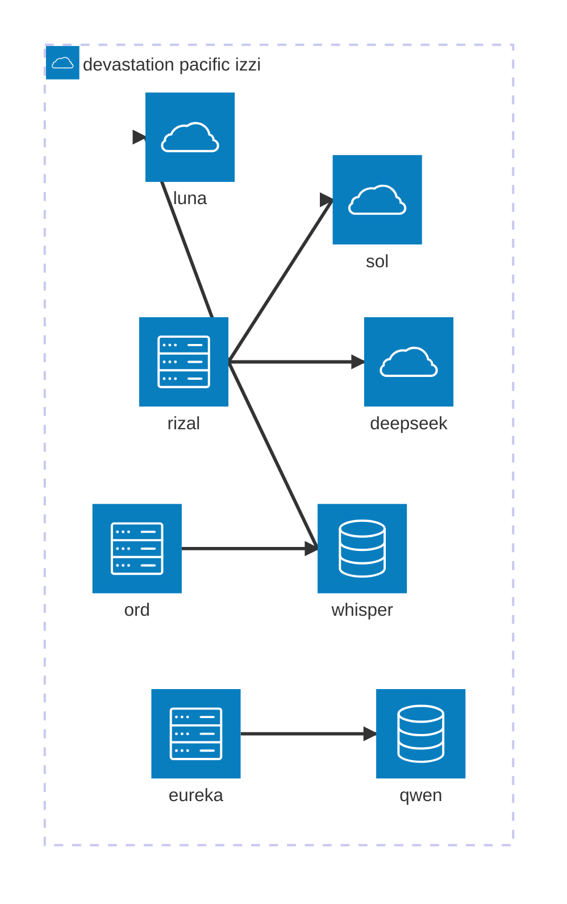
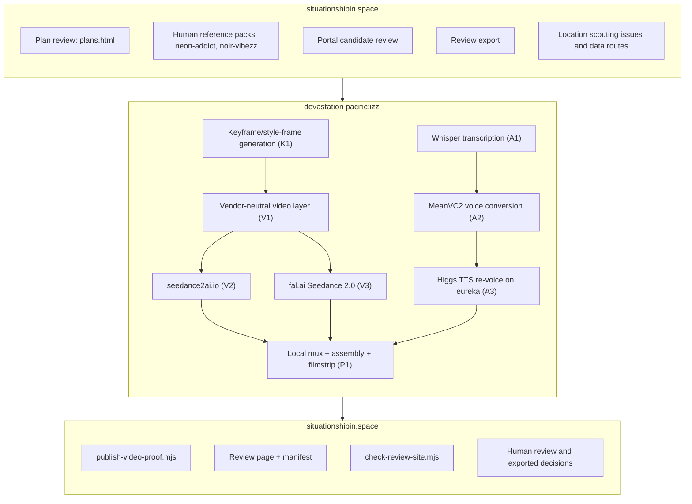
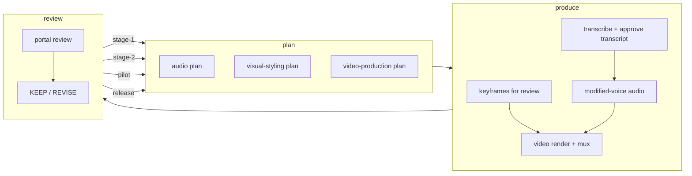

# Workflows

Status: WORKFLOW-V2-W1; DRAFT-AWAITING-REVIEW
Recorded: 2026-08-18 America/Los_Angeles

See also: [transcription enrichment workflow](transcription-enrichment_workflow.md)
(post-transcription formatting layer for the here-lies-trouble canonical
transcript) and [visual workflow](visual_workflow.md) (visual passes plus
the [supercut](supercut.md) usage guide, moved there in the 2026-08-22
documentation pass).

## izzi architecture

Host and model map (visual form of §5.2 of
`docs/development/sessions/20260817.fal.ai_stage_2.md`), converted to
Mermaid `architecture-beta` for this page. Hosts use the `server` icon,
local models the `database` icon, and hosted models the `cloud` icon; each
edge runs host → model.

Node details (the short labels above map to the §5.2.1 names):

| Label | Node |
| --- | --- |
| rizal | control plane — Fedora 43 · Ryzen 9 3950X 16C/32T · 62 GiB RAM · Quadro RTX 4000 8 GB VRAM |
| eureka | Higgs + Qwen render — Fedora 43 · Ryzen AI MAX+ 395 · Radeon 8060S gfx1151 · 125 GiB unified RAM |
| ord | audio encode — Fedora 43 · Ryzen AI MAX+ 395 · Radeon 8060S gfx1151 · 125 GiB unified RAM |
| whisper | transcription (ASR) — whisper.cpp / faster-whisper · rizal/ord |
| qwen | keyframes (image model) — Qwen-Image-Edit-2511 20B · eureka |
| sol | sol-5.6 — HLT keyframes — gpt-5.6-sol-max · hosted OpenAI · provenance gaps §5.5 |
| luna | luna-5.6 — ai-time-to-die interstitials — gpt-5.6-luna-medium · hosted OpenAI |
| deepseek | deepseek-v4-pro / deepseek-v4-flash — interstitials · hosted DeepSeek |

The §5.2.1 flowchart and its 2026-08-17 PASS verdict remain the
authoritative record for the model spellings, host hardware, and provenance
gaps (§5.5); this diagram is the architecture-beta rendering of the same
map.

## Baseline v1

The v1 internal nodes remain authoritative vocabulary: `situationshipin.space`: plan review (`plans.html`), human reference packs (neon-addict, noir-vibezz), portal candidate review, review export, location scouting issues (#10-15) and `data/locations.json` routes. `devastation pacific:izzi`: Whisper transcription (A1), MeanVC2 voice conversion (A2), Higgs TTS re-voice on eureka (A3), keyframe/style-frame generation (K1), vendor-neutral video layer (V1), local mux + assembly + filmstrip (P1). `Video vendors`: seedance2ai.io (V2), fal.ai Seedance 2.0 (V3). bottom `situationshipin.space`: publish, review page + manifest, `check-review-site.mjs`, human review and exported decisions.

## Workflow v2

The four feedback edges carry the stage name, so every `REVISE` decision returns to the same stage's plan with its evidence attached.

## Stage gates

- Visual-styling `KEEP` unlocks video-production.
- Audio `KEEP`, together with visual-styling `KEEP`, unlocks video-production.
- Both approvals are published portal artifacts (`visual-styling.json`, `audio.json`) carrying `KEEP` or `REVISE`.
- No video work starts before the approvals.
- The four development stages (stage-1, stage-2, pilot, release) and their
  review→plan feedback edges are enumerated in
  `workflow-stages.json`, checked by
  `scripts/check-workflow-stages.py`.

## Indexes

- [`docs/audio_workflow.md`](audio_workflow.md) — Status: `FIRST-PASS-SORT; NO-REMOVAL; NOT-SHARED`
- [`docs/visual_workflow.md`](visual_workflow.md) — Status: `FIRST-PASS-SORT; NO-REMOVAL; NOT-SHARED`

House rule: sort and link, do not rewrite evidence.

## Provenance

Diagrams authored by `gpt-5.6-sol` via the Responses API `apply_patch` tool for W1 of `20260818.workflow_v2_proposal.md`. Acceptance requires the diagrams to be render-verified against Mermaid v11.16.1; human review pending.

Local render-verify 2026-08-18: PASS — both diagrams render under Mermaid
v11.16.1 (mmdc 11.16.0 with mermaid 11.16.1); the Baseline v1 inter-box
arrows sit on one centered axis and the Workflow v2 loop carries all four
feedback edges.

Portal inspection:
<https://situationshipin.space/review/workflow-v2-diagram-index/>
(W7, decision UNREVIEWED).
